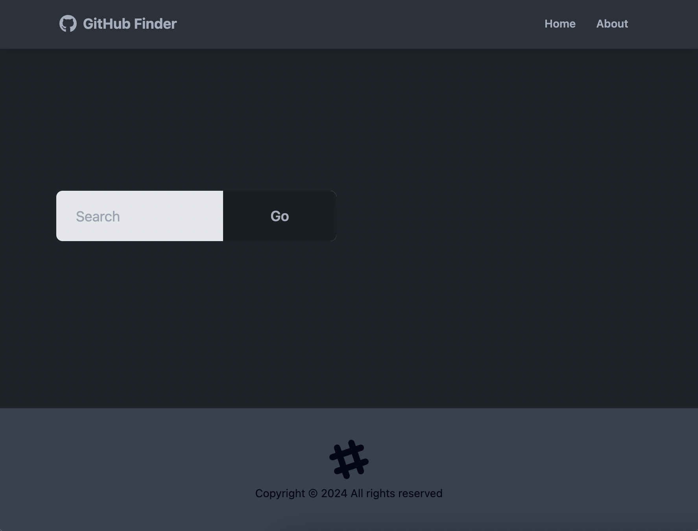
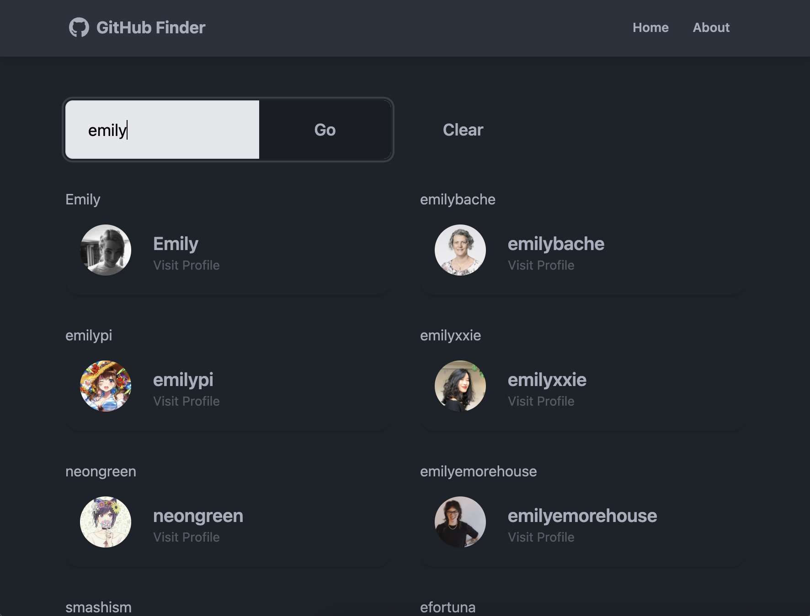
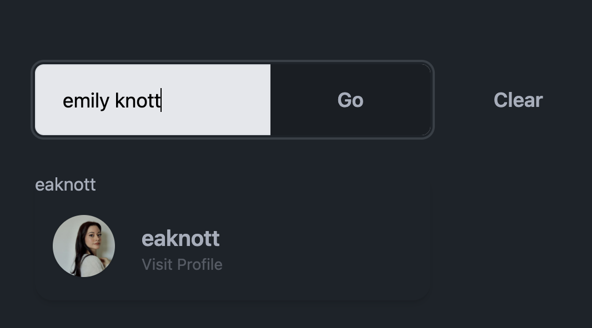
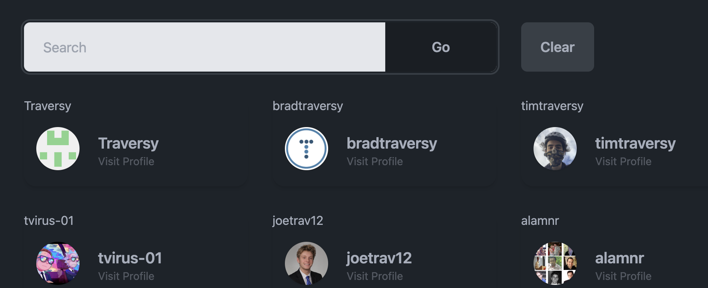

# GitHub Finder App

A simple app leveraging the GitHub API to search GitHub users and display profile information and basic metrics.

## Table of contents

- [Overview](#overview)
  - [Built with](#built-with)
- [Usage](#usage)
  - [Home page](#home-page)
  - [About page](#about-page)
  - [Searching users](#searching-users)
  - [Clearing search results](#clearing-search-results)
  - [Viewing profiles](#viewing-profiles)
- [Acknowledgments](#acknowledgments)

## Overview

This app allows users to search GitHub for users by name or by GitHub username. Users may view GitHub profiles with basic metrics, including number of followers, number of public gists, number of public repositories, photo, location, website, and whether they are hireable. The page also displays that profile's latest public repositories with certain metrics such as number of forks and number of stars, and there is a button to take the user to that profile's GitHub as well.

#### Built with

- React.js
- GitHub API
- Tailwind CSS
- DaisyUI
- Deployed to Vercel

## Usage

#### Home page

The home page of this app has a simple interface. A navbar at the top right can take the user to an About page or to the Home page. Clicking the "GitHub Finder" in the top left also takes the user to the home page. There is a search bar for typing any input to search GitHub users.

#### About page

The About page has a simple description of the app, listing some of the main technologies used, with acknowledgments and links to the appropriate authors and courses.

#### Searching users

Searching is case insensitive, and the search results display all users that match the input.

Searches can be done by name or by username. Search results displayed on the home page are composed the profile photo, profile username, and a "Visit Profile" button to take the user to the profile.

#### Clearing search results

Users may clear the search results by clicking the "Clear" button to the right of the search "Go" button.

#### Viewing profiles

Profiles display data from the GitHub profile, including badges for "User" and whether they are "Hireable". Other information displayed includes bio, location, website, number of followers and following, and number of public gists and repositories.

Scrolling down below the profile metrics, users can view the profile's latest repos and metrics on each of those, including repo description, number of stars and number of forks.

## Acknowledgments

Author: [Emily Knott](www.emilyknott.com)

This project was built as part of [Traversy Media](https://github.com/bradtraversy)'s comprehensive React course: [React Front to Back Course](https://www.traversymedia.com/Modern-React-Front-To-Back-Course)
